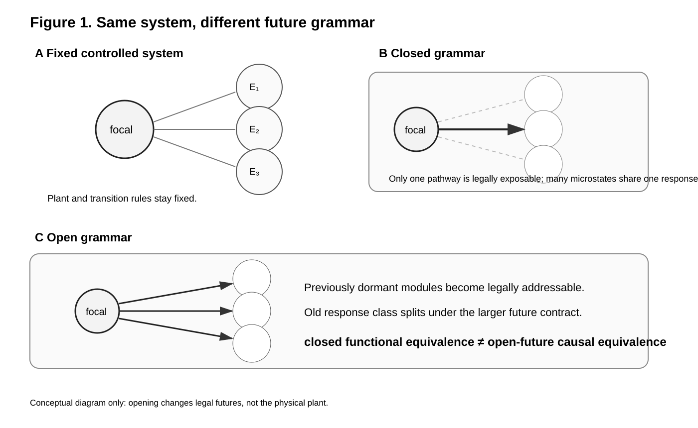
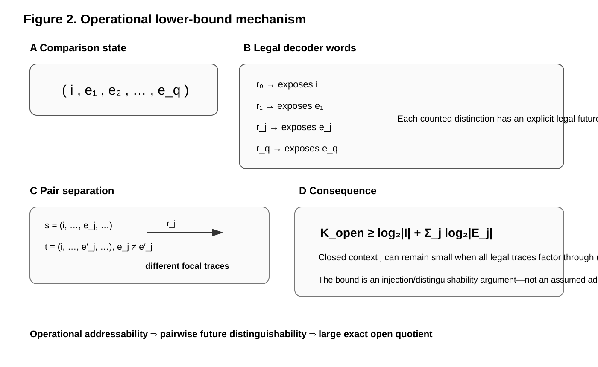
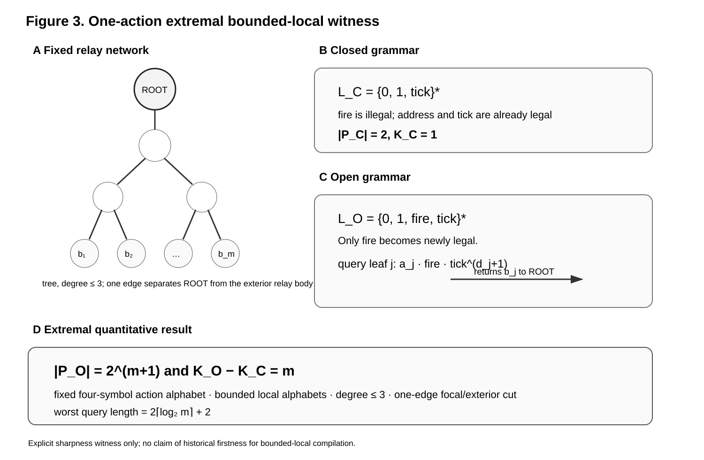
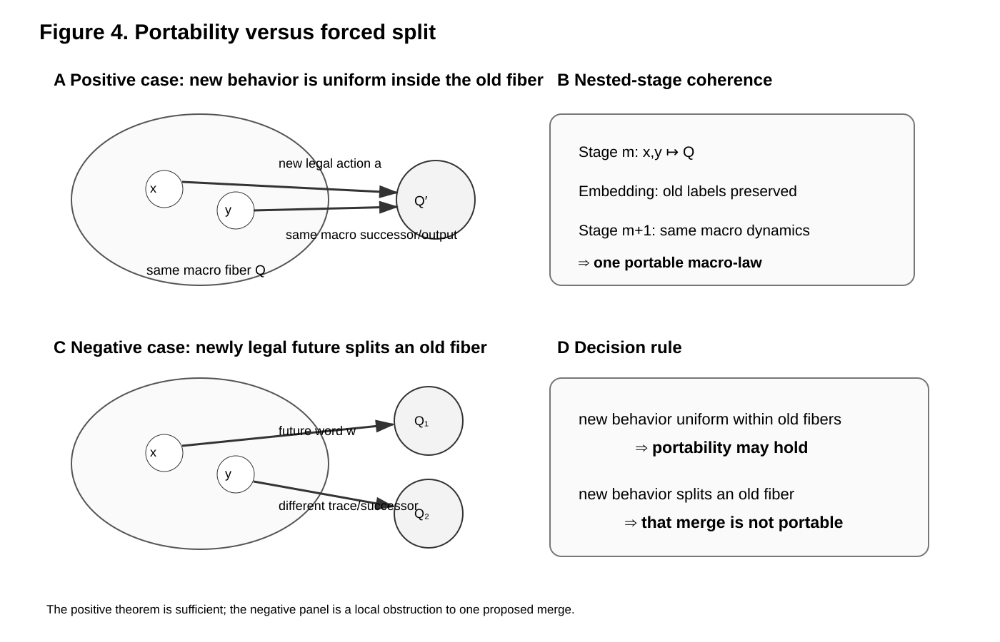

# Rendered figures

The four manuscript figures are vector SVGs generated from `manuscript/figures_spec.md`. They are conceptual/mathematical figures, not empirical graphics.

## Figure 1 — Same system, different future grammar

**Caption.** The physical controlled system is held fixed while the legal future grammar changes. Under the closed grammar, only a restricted subset of pathways is legally exposable and multiple microstates can share one exact response class. Under the opened grammar, previously dormant modules become legally addressable and the old class can split. The figure illustrates contract-relative equivalence; it does not claim that openness always destroys compression.

## Figure 2 — Operational lower-bound mechanism

**Caption.** A comparison state is represented as `(i,e1,...,eq)`. A base word exposes the inside coordinate and module-specific legal future words expose individual exterior coordinates. If two states differ in coordinate `e_j`, the corresponding legal word separates their focal responses. The lower bound therefore follows from explicit future distinguishability, not from assuming that information contributions add independently.

## Figure 3 — One-action extremal bounded-local witness

**Caption.** The balanced relay network and transition rules are unchanged between closed and open comparisons. The closed grammar permits `0`, `1`, and `tick`; opening legalizes only `fire`. A leaf-specific address followed by `fire` and propagation ticks reads one dormant bit into the focal output. The closed quotient has two classes while the open quotient is discrete on `2^(m+1)` comparison states, yielding the maximal `m`-bit increase under fixed four-symbol controls, degree at most three, bounded local alphabets, a one-edge focal/exterior cut, and logarithmic access. The relay is an explicit sharpness witness, not a historical-firstness claim.

## Figure 4 — Portability versus forced split

**Caption.** In the positive case, newly legal behavior is uniform within an old macro fiber and both microstates retain the same macro successor and output behavior, so the old macro law can remain portable. In the negative case, a newly legal word or action sends formerly merged states to different traces or successors, which certifies that the proposed merge is not portable. The positive statement is sufficient rather than a full characterization of every portable abstraction.
